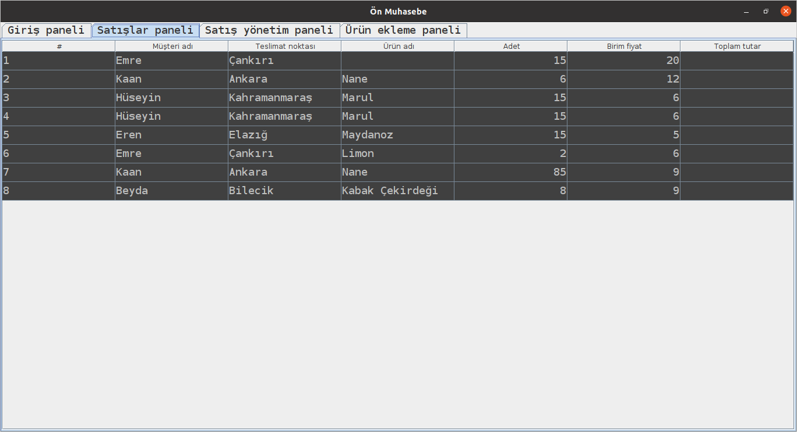

# Ön muhasebe programı

---

## Giriş ekranı 

---

## Satış yönetim paneli

Bu ekranda kayıtları yapabiliriz. ürün isimleri veri tabanına eklediğimiz isimlerden gelir.
Toplam değer otomatik hesaplanır.

## Ürün ekleme paneli

Ürün bilgileri veri tabanına eklenir

---

## Rapor paneli

bu ekranda kayıtlar excel dökümanı olarak dışa aktarılacaktır.